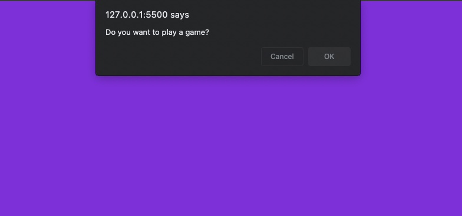
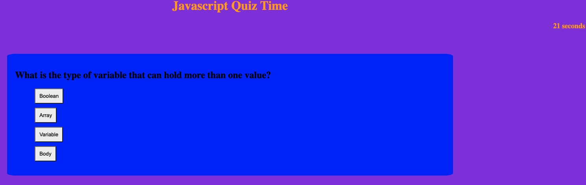
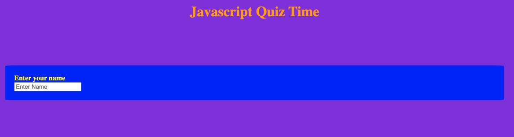

# JavaScript-Test

Accepted Criteria:

GIVEN I am taking a code quiz
WHEN I click the start button
THEN a timer starts and I am presented with a question
WHEN I answer a question
THEN I am presented with another question
WHEN I answer a question incorrectly
THEN time is subtracted from the clock
WHEN all questions are answered or the timer reaches 0
THEN the game is over
WHEN the game is over
THEN I can save my initials and score

The following code, starts with a prompt, which can start the game. Once the game is started, there is a timer on the right hand side, and the first question appears. Once answered correctly, and "next" box will pop up where you can click it and go to the next question, until the quiz is finished.

Start of game:

Question prompt;

Finish game;

